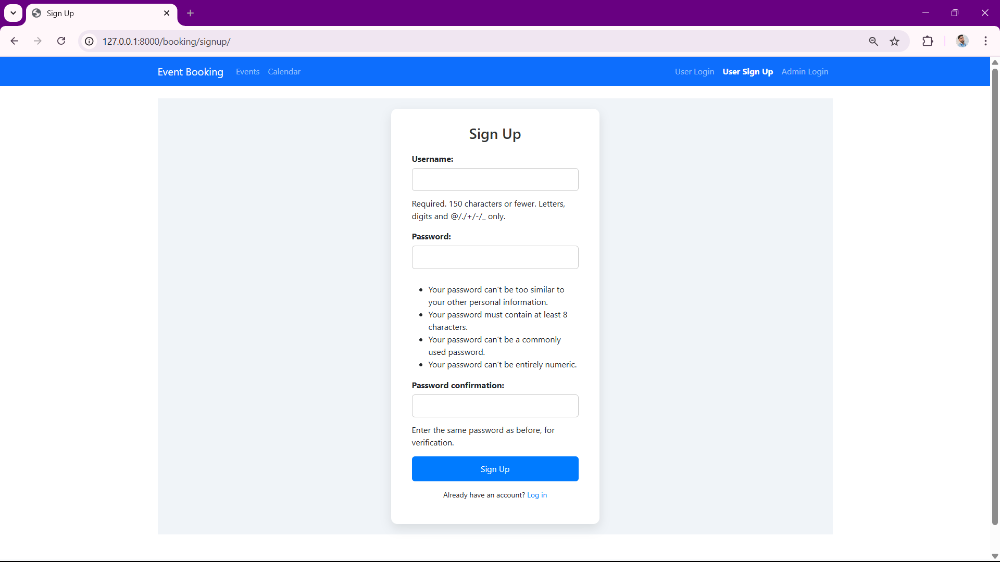
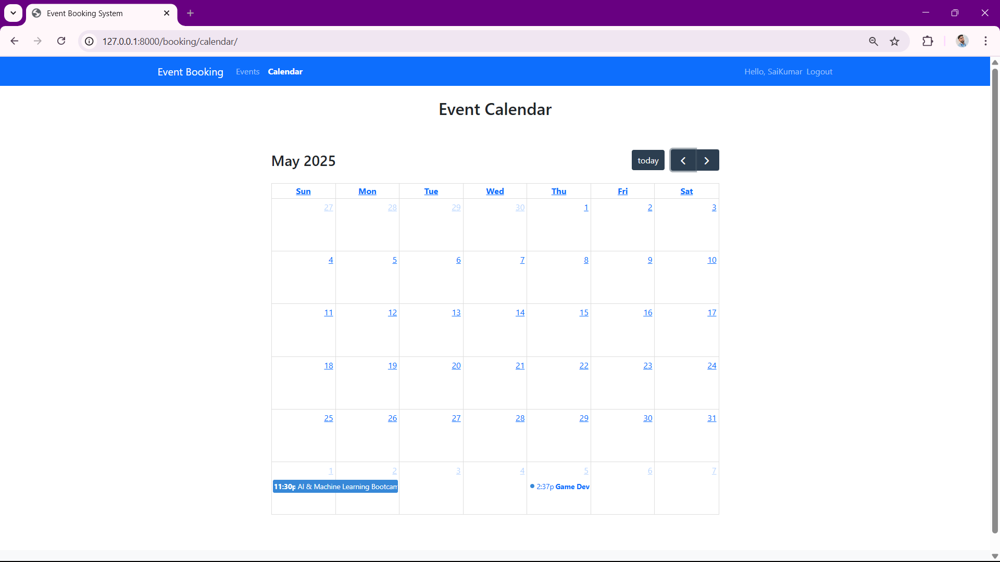
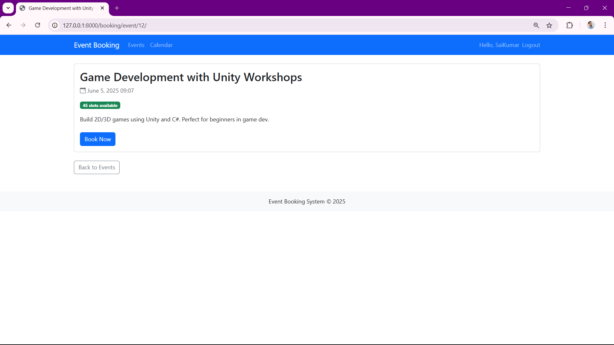
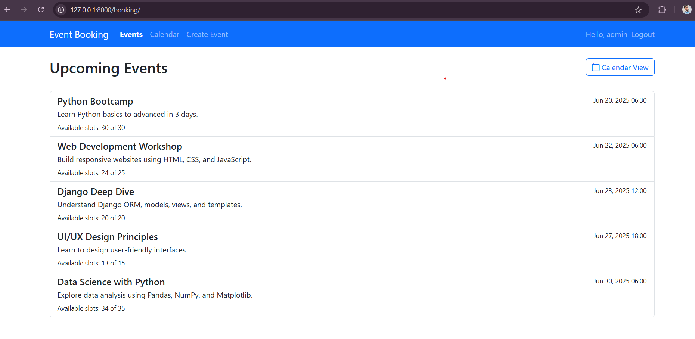
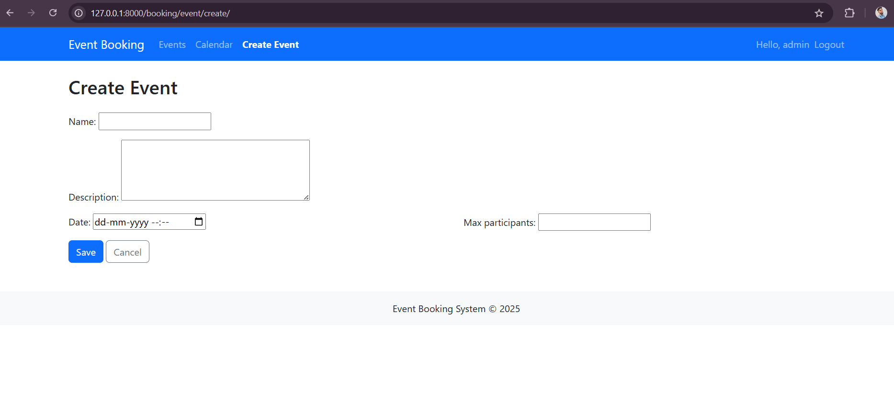

# 📅 Event Booking System with Calendar View (Django)

A full-featured event booking system built with **Django**. Users can book slots for events, view upcoming events on a calendar, and manage their own bookings. Admins can create, edit, and delete events, and view all bookings.

---

## ✨ Features

### 👥 User Roles

- **Users**:
  - Register/Login/Logout
  - View available events on a calendar
  - Book a slot for available events
  - View list of their own booked events
  - Prevent duplicate booking for the same event

- **Admins**:
  - Create/Edit/Delete events
  - Set maximum participant limits
  - View list of all bookings

### 📆 Calendar View

- Integrated using **FullCalendar.js**
- Clickable events open details and booking option
- Displays events with seat availability

---

## 🛠 Tech Stack

- **Backend**: Django (Python)
- **Frontend**: HTML, CSS, Bootstrap, JavaScript
- **Calendar**: FullCalendar.js
- **Database**: SQLite (default), easy to switch to PostgreSQL
- **Version Control**: Git + GitHub

---
## 📸 Screenshots

### Signup Page 

### Event Calender View

### Event Booking View

###  Home Page

### Create Event

